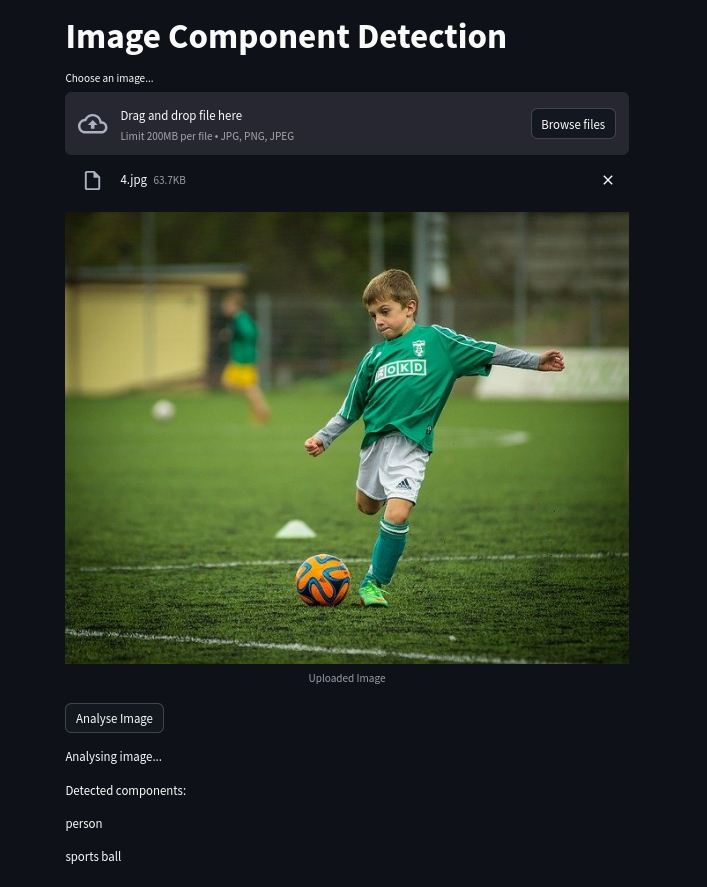

# Image Component Detection with Streamlit and PyTorch



## Overview

This project demonstrates a Streamlit application for image component detection using a pre-trained Faster R-CNN model implemented in PyTorch. Users can upload an image, analyze it using the model, and display detected component names.

## Requirements

Ensure you have the following installed before running the project:

- Python 3.6+
- Streamlit
- PyTorch
- torchvision
- Pillow

You can install the required Python packages using pip:

```bash
pip install -r requirements.txt
```

## How to Run the Project

### 1.Clone the repository to your local machine:

```bash
git clone https://github.com/your_username/image-component-detection.git
cd image-component-detection
```

### 2.Install the required dependencies:

```bash
pip install -r requirements.txt
```

### 3.Run the Streamlit application:

```bash
streamlit run app.py
```

### If you encounter the "AxiosError: Request failed with status code 403" error, you can run the application with XSRF protection disabled (suitable for local development):

```bash
streamlit run app.py --server.enableXsrfProtection false
```

### 4.The application will open in your default web browser. Upload an image using the file uploader and click "Analyse Image" to detect components in the image.

## Project Structure
- `app.py` : Main Streamlit application script.
- `requirements.txt` : List of Python dependencies for the project.
- `demo.png` : Sample screenshot or demo image of the application (optional).
- `README.md` : This file, providing project information and instructions.
